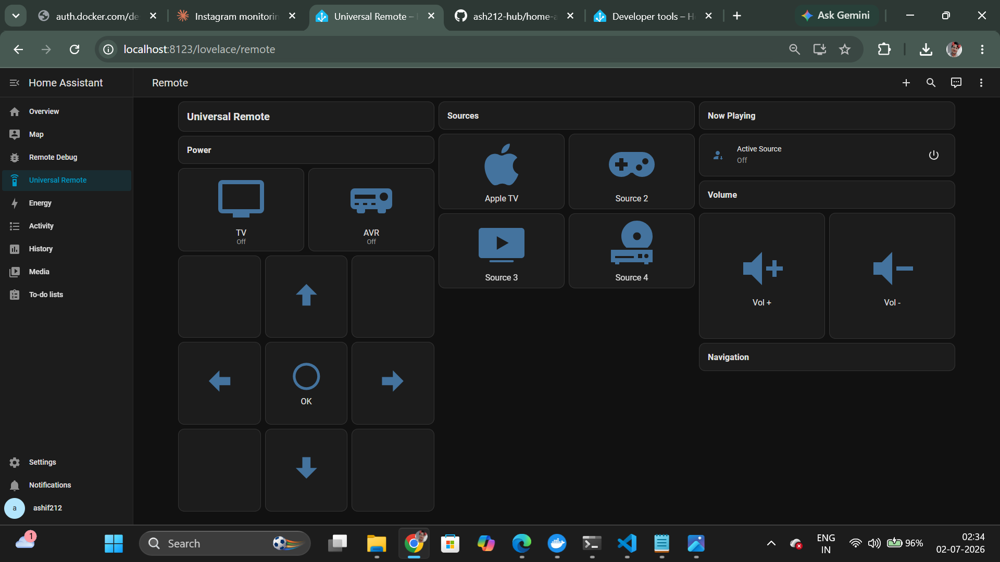
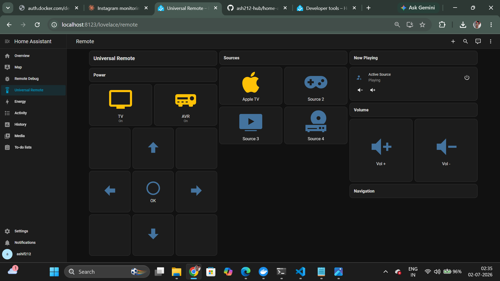
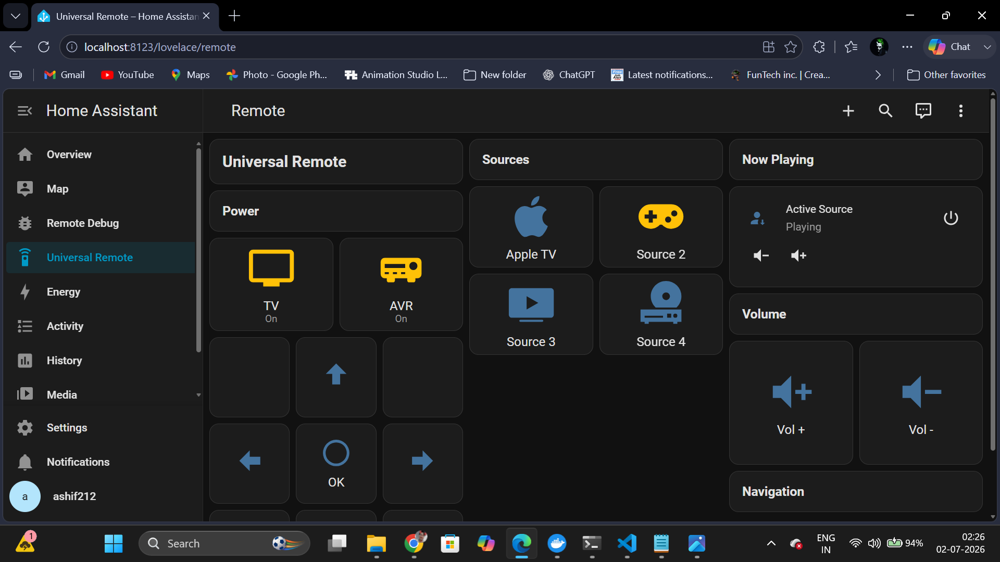
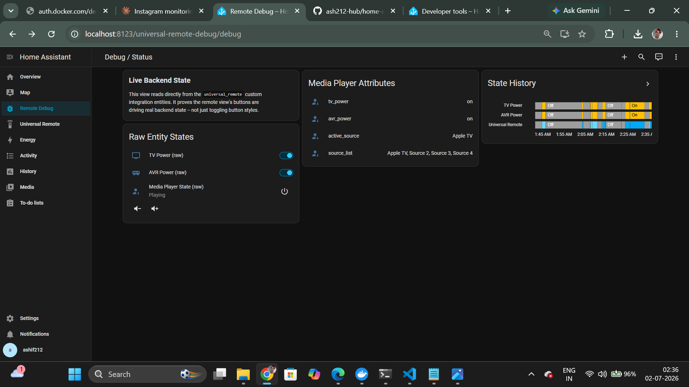

  # Universal Remote — Home Assistant Practical Assessment

A mock universal remote built on Home Assistant OS: a Python custom
integration owns all state (TV power, AVR power, active source), and
a two-view Lovelace dashboard provides the remote UI plus a live
debug/status panel.

## Repo structure

```
your-repo/
├── screenshots/
│   ├── idle-state.png
│   ├── appletv-active.png
│   ├── source2-active.png
│   └── debug-panel.png
├── custom_components/
│   └── universal_remote/
│       ├── manifest.json     # integration metadata
│       ├── const.py          # SOURCES list, icons, domain — single place to edit
│       ├── controller.py     # RemoteController: the ONLY source of truth
│       ├── __init__.py       # boots the controller, forwards to platforms
│       ├── switch.py         # TV Power / AVR Power entities (thin wrappers)
│       └── media_player.py   # source selection + status display entity
├── config/
│   ├── configuration.yaml        # wires the integration + dashboards into HA
│   ├── ui-lovelace.yaml          # main remote view
│   └── ui-lovelace-debug.yaml    # secondary debug/status view
├── README.md
└── .gitignore
## Repo structure

```
 

### Why one `RemoteController` class

Every entity (`switch.tv_power`, `switch.avr_power`,
`media_player.universal_remote`) is a thin view over a single
`RemoteController` instance stored in `hass.data`. No entity holds
its own copy of state or makes its own decisions — they call
`controller.turn_on_tv()`, `controller.select_source()`, etc., and
the controller is the only place state actually changes.

This is the same reasoning I'd apply to an Express API: one state
store, entities/routes as thin I/O layers, no business logic
duplicated across handlers. It's also what the brief requires
explicitly — *"all state management and source-switching logic MUST
be handled by the custom integration"* — so none of this logic lives
in dashboard YAML or automations.

### How the mock source state works

- `RemoteController` holds three pieces of state in memory:
  `tv_power`, `avr_power`, `active_source` (one of the 4 sources, or
  `None`).
- Selecting a source (`select_source()`) also powers on the TV and
  AVR — a realistic transition, not an isolated flag flip.
- Turning the TV off clears the active source and powers off the AVR
  too, mirroring how a real setup cascades.
- Entities subscribe to the controller via `add_listener()`, so any
  state change immediately triggers `schedule_update_ha_state()` on
  every affected entity — the dashboard updates instantly, no
  polling.
- Sources are data-driven from `const.py`'s `SOURCES` list — nothing
  is hardcoded per-source in the controller or entities.

### No real device is contacted

Per the brief, this is entirely mocked. No IR, no network calls, no
TV OS API — `RemoteController` just holds Python variables in
memory. Restarting Home Assistant resets state to off/no source,
which is expected for a mock.

## Setup / installation

This build runs Home Assistant via **Docker** (Home Assistant Container)
rather than Home Assistant OS in a VM. Functionally identical for this
assessment's purposes — same entities, same custom integration support,
same Lovelace dashboards — just far more reliable to network and manage
than a VirtualBox VM on a Wi-Fi-only host.

1. Install [Docker Desktop](https://www.docker.com/products/docker-desktop/)
   for Windows (requires WSL2 — Docker will prompt to install it if
   missing; restart after WSL2 installs).
2. Create a local config folder, e.g. `C:\HA-Docker\`.
3. Run the container, mounting that folder as `/config`:

   ```
   docker run -d --name homeassistant -p 8123:8123 -v C:\HA-Docker:/config --restart=unless-stopped ghcr.io/home-assistant/home-assistant:stable
   ```

4. Open `http://localhost:8123` and complete the onboarding wizard
   (create user, name, location).
5. Copy `custom_components/universal_remote/` directly into
   `C:\HA-Docker\custom_components\universal_remote\` (Docker's bind
   mount means this folder is live-editable from Windows — no add-on
   needed).
6. Copy `ui-lovelace.yaml` and `ui-lovelace-debug.yaml` directly into
   `C:\HA-Docker\` (same level as `configuration.yaml`).
7. Edit `C:\HA-Docker\configuration.yaml` to register the integration
   and both dashboards:

   ```yaml
   default_config:

   automation: !include automations.yaml
   script: !include scripts.yaml
   scene: !include scenes.yaml

   universal_remote:

   switch:

   media_player:

   lovelace:
     resource_mode: yaml
     dashboards:
       lovelace:
         mode: yaml
         filename: ui-lovelace.yaml
         title: Universal Remote
         icon: mdi:remote
         show_in_sidebar: true
       universal-remote-debug:
         mode: yaml
         filename: ui-lovelace-debug.yaml
         title: Remote Debug
         icon: mdi:bug
         show_in_sidebar: true
   ```

8. Restart the container to apply changes:

   ```
   docker restart homeassistant
   ```

9. Refresh `http://localhost:8123`. Two new sidebar entries appear:
   **Universal Remote** (main control surface) and **Remote Debug**
   (raw entity state / history — proves the backend, not just button
   styling, is driving the UI).

## Notes

- The `lovelace:` block uses the current (non-deprecated) dashboard
  registration format — `resource_mode: yaml` at the top level plus a
  `dashboards:` map, rather than the older `mode: yaml` shorthand,
  which Home Assistant is retiring in a future release.
- `automation:`, `script:`, and `scene:` `!include` lines are kept
  even though this project doesn't use them, since `default_config:`
  expects them and Docker's fresh config folder auto-creates the
  empty target files (`automations.yaml`, `scripts.yaml`,
  `scenes.yaml`) on first boot.

## How to extend

- **Add a 5th source:** add one line to `SOURCES` in `const.py`, plus
  one button block in `ui-lovelace.yaml`. No changes needed to
  `controller.py`, `switch.py`, or `media_player.py` — the state
  logic is already generic.
- **Add volume level tracking:** extend `RemoteController` with a
  `_volume` field and wire `async_volume_up/down` in
  `media_player.py` to call real controller methods instead of the
  current no-op placeholders.
- **Swap the mock for a real device:** replace the bodies of
  `RemoteController`'s methods with actual API/IR calls — the
  entities and dashboard don't need to change at all, since they
  only ever talk to the controller's public methods.

## Demo

**Idle state** — TV and AVR off, no active source:



**Apple TV active** — source selected, TV and AVR powered on:



**Source 2 active** — switching sources updates state instantly:



**Debug panel** — raw entity state/history, showing the backend
(not just button styling) is driving the UI:


